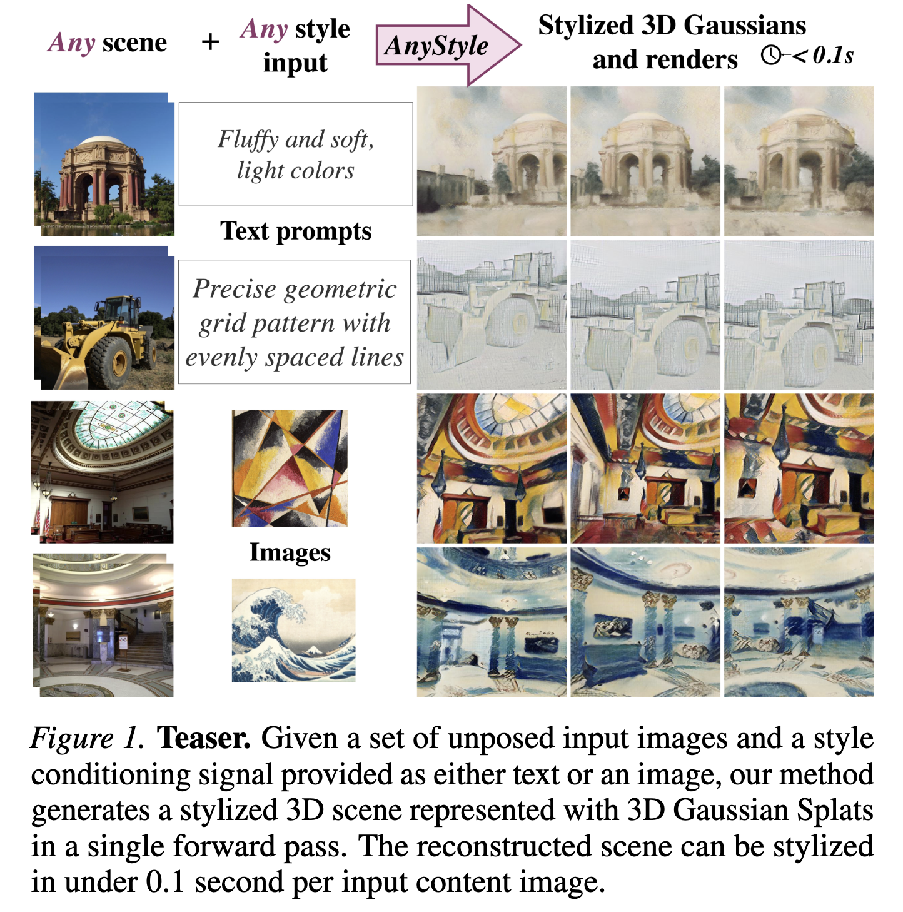

# AnyStyle: Single-Pass Multimodal Stylization for 3D Gaussian Splatting

<p align="center">
  <a href="https://arxiv.org/abs/2602.04043"></a>
  &nbsp;&nbsp;|&nbsp;&nbsp;
  <a href="https://anystyle3dgs.github.io/"></a>
</p>

[](assets/teaser.png)

Please note, that this repo is based on AnySplat. Since we used only subset of original repo functionality there are obsolete .py scripts located in `src` directory. We tried our best to delete any irrelevant files, but due to limited time resources there may still be leftovers. Read this file carefully as it contains tested execution path.

## 1. Installation

The code has been tested on below configuration:
* Python 3.10
* CUDA 11.8

**Bare in mind that checkpoints from article has been obtained on machine with PyTorch 2.4.0 and CUDA 12.4, but due to specific infrastructure, we are not able to provide exactly the same environment setup.**


### Clone
```bash
git clone https://github.com/Clone/this/repo.git
cd AnyStyle
```

### Create environment
2. Create environment. You will need CUDA 11.8 installed, other dependencies are taken care of with `uv`.
```bash
uv venv --python 3.10
uv sync
```

### Download CLIP model
Get `longclip-B-32.pt` checkpoint from [here](https://huggingface.co/BeichenZhang/LongCLIP-B-32/tree/main) and put it into `src/longclip/checkpoints/`.


## 2. Inference

Download our trained checkpoints from [Zenodo Repository](https://zenodo.org/records/18816747). The path where checkpoints should be placed is up to the user, since it has to be specified in respective configs.

Run below:
- `python inference_style.py --config config/style_inference/evaluate.yaml` - generate stylized reconstruction
- `python inference_style_interp.py --config config/style_inference/interpolate.yaml` - interpolation between two styles  

See in yaml how styles are assigned to scenes.


## 3. Evaluation
We follow the evaluation protocol from [StylOS](https://github.com/HanzhouLiu/StylOS). Evaluation images and corresponding descriptions are found in `zip` archive under `assets/evaluation_and_splits.zip`. 

Run `bash evaluation/eval_txt.sh` or `bash evaluation/eval_img.sh`. All eval scripts will run automatically, just set `run_dir` and `output_path` .sh file.

For evaluation we used scripts and codes publicly available:
- Most stylization metrics (ArtFid, HistoGan) from [StyleID](https://github.com/jiwoogit/StyleID/tree/main/evaluation) 
- [ArtScore](https://github.com/jchen175/ArtScore) 
- [Consistency](https://github.com/Kunhao-Liu/StyleGaussian/issues/5) 

You will need checkpoints for RAFT model and ArtScore model:
- [raft-things.pth](https://huggingface.co/Iceclear/MGLD-VSR/blob/main/raft-things.pth) 
- [ArtScore model](https://github.com/jchen175/ArtScore/blob/main/ckpt/loss%40listMLE_model%40resnet50_denseLayer%40True_batch_size%4016_lr%400.0001_dropout%400.5_E_8.pth) 

## 4. Training from scratch

### Used data

- content: [DL3DV-480P](https://huggingface.co/datasets/DL3DV/DL3DV-ALL-480P)
- style: [wikiart](https://huggingface.co/datasets/huggan/wikiart)
- textual descriptions of **wikiarts**: `zip` archive under `assets/evaluation_and_splits.zip`

### Data structure

Under some directory containing data `some/path/to/data`, called `root`, create following file structure:

```
root  
    |-- dl3dv
        |-- DL3DV-10K
        |-- train_index.json
        |-- test_index.json
    |-- wikiart
        |-- Abstract_Expressionism
        |-- ...
        |-- wikiarts_descriptions.txt
        |-- wikiarts_test_files.txt
``` 

### Training

We use pretrained AnySplat model and only finetune it for stylization. Pretrained AnySplat model will load automatically. To run finetuning:

```
# single node only tested:
CUDA_VISIBLE_DEVICES=0 python src/main_finetune.py +experiment=dl3dv_aggregator trainer.num_nodes=1 

``` 
Example training configs are available in `config/experiment` folder:  
-  `dl3dv_head.yaml` for simple clip embedding injection to gaussian head, 
- `dl3dv_aggregator.yaml` with injection to aggregator.   

To optimize only colors / colors+rotations / colors+scales+rotations+opacities use params: `style_geom_features: none`, `style_geom_features: colors-rotations` or `style_geom_features: no-pos` accordingly.

### Couple of warnings

- CUDA OOM can occur, see this issue https://github.com/InternRobotics/AnySplat/issues/47,   
- Also, be careful about RAM: when making new config, be sure to include these in dataloader: num_workers: `small int`, persistent_workers: false, pin_memory: false.


## Acknowledgments
This project is based on [AnySplat](https://github.com/InternRobotics/AnySplat) with some code lifted from [StylOS](https://github.com/HanzhouLiu/StylOS). We would like to thank authors of StylOS for guidelines and code for evaluation. We would also like to thank [Styl3R](https://github.com/WU-CVGL/Styl3R) for providing checkpoints for evaluation. We sincerely thank all the authors for open-sourcing their work. 